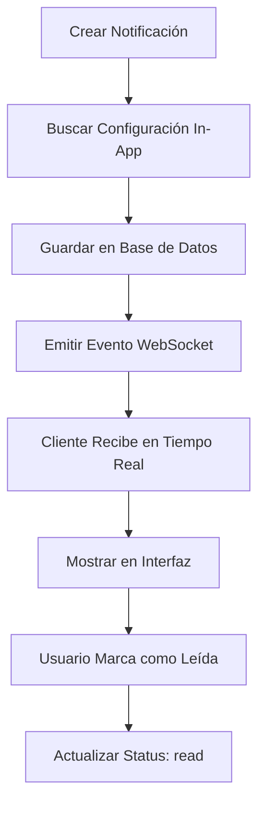
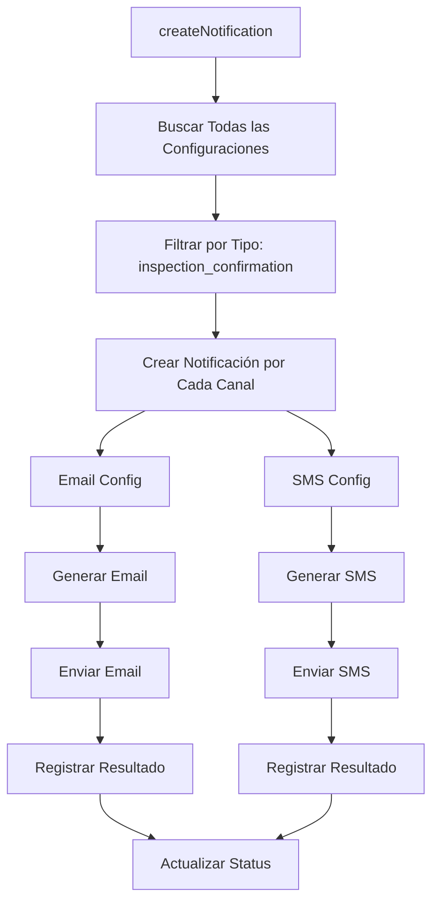
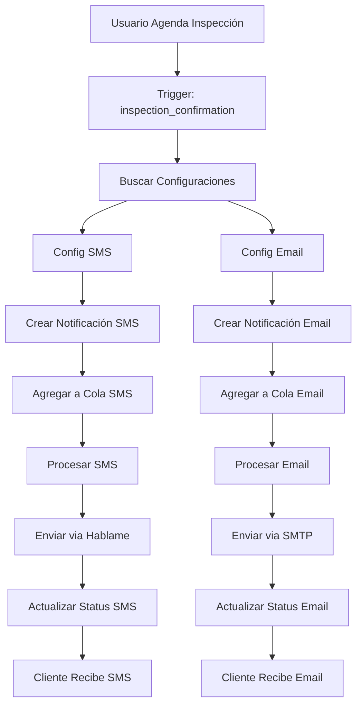

# Sistema de Notificaciones - Flujo y Relaciones

## 📊 Relaciones entre Tablas de Notificaciones

### Estructura de Base de Datos

```sql
-- Tabla principal de tipos de notificación
notification_types
├── id (PK)
├── name (inspection_confirmation, inspection_reminder, etc.)
└── description

-- Tabla de canales disponibles
notification_channels
├── id (PK)
├── name (email, sms, whatsapp, in_app, sistema)
└── active

-- Tabla de configuración (relaciona tipos con canales)
notification_configs
├── id (PK)
├── notification_type_id (FK → notification_types)
├── notification_channel_id (FK → notification_channels)
├── name
├── template_title
├── template_content
├── for_clients (boolean)
├── for_users (boolean)
├── target_roles (JSON)
├── active
└── priority

-- Tabla de notificaciones enviadas
notifications
├── id (PK)
├── notification_config_id (FK → notification_configs)
├── recipient_user_id (FK → users, nullable)
├── inspection_order_id (FK → inspection_orders, nullable)
├── appointment_id (FK → appointments, nullable)
├── title
├── content
├── recipient_email
├── recipient_phone
├── status (pending, sent, delivered, failed)
├── sent_at
└── delivered_at

-- Tabla de cola de notificaciones
notification_queue
├── id (PK)
├── notification_id (FK → notifications)
├── retry_count
├── next_retry_at
├── priority
└── status (queued, processing, completed, failed)
```

### Diagrama de Relaciones

```
notification_types (1) ←→ (N) notification_configs (N) ←→ (1) notification_channels
                                    ↓
                            notifications (1) ←→ (1) notification_queue
                                    ↓
                            users / inspection_orders / appointments
```

## 🔄 Flujo de Envío por Canal

### 1. **Email (SMTP)**

```mermaid
graph TD
    A[Crear Notificación] --> B[Buscar Configuración Email]
    B --> C[Generar HTML desde Template]
    C --> D[Validar Email Destinatario]
    D --> E[Enviar via NodeMailer]
    E --> F{¿Enviado?}
    F -->|Sí| G[Actualizar Status: delivered]
    F -->|No| H[Reintentar (hasta 3 veces)]
    H --> I[Actualizar Status: failed]
    G --> J[Registrar en Log]
```

**Características:**

- **Template:** HTML + Texto plano
- **Variables:** `{{inspection_order.nombre_cliente}}`, `{{appointment.date}}`, etc.
- **Prioridad:** Normal/High
- **Reintentos:** 3 veces con backoff exponencial
- **Validación:** Formato de email

### 2. **SMS (Hablame API)**

```mermaid
graph TD
    A[Crear Notificación] --> B[Buscar Configuración SMS]
    B --> C[Formatear Número Teléfono]
    C --> D[Validar Número (Colombia)]
    D --> E[Enviar via Hablame API]
    E --> F{¿Enviado?}
    F -->|Sí| G[Actualizar Status: delivered]
    F -->|No| H[Reintentar (hasta 3 veces)]
    H --> I[Actualizar Status: failed]
    G --> J[Registrar en Log]
```

**Características:**

- **Template:** Texto plano (máximo 140 caracteres)
- **Variables:** Mismas que email pero texto corto
- **Prioridad:** Normal/High
- **Reintentos:** 3 veces
- **Validación:** Formato colombiano (+57)

### 3. **In-App (Sistema Interno)**



**Características:**

- **Template:** JSON con datos estructurados
- **Variables:** Objetos completos
- **Prioridad:** Normal
- **Reintentos:** No aplica
- **Persistencia:** En base de datos

## 🔗 Canales Compartidos (Múltiples Canales)

### Escenario: Confirmación de Agendamiento

Cuando se agenda una inspección, se debe enviar **SMS + Email** al cliente:

```javascript
// Ejemplo de uso
await notificationService.createNotification('inspection_confirmation', {
  inspection_order: inspectionOrder,
  appointment: {
    date: '2024-01-15',
    time: '14:00',
    location: 'CDA Norte',
  },
});
```

### Flujo de Procesamiento



### Implementación en el Código

```javascript
// En notificationService.js
async createNotification(type, data, options = {}) {
    // 1. Buscar todas las configuraciones para este tipo
    const configs = await NotificationConfig.findAll({
        where: {
            notification_type_id: typeId,
            active: true
        },
        include: [
            { model: NotificationType, as: 'type' },
            { model: NotificationChannel, as: 'channel' }
        ]
    });

    // 2. Crear notificación para cada canal
    for (const config of configs) {
        // Determinar destinatarios según configuración
        const recipients = await this.getRecipients(config, data, options);

        for (const recipient of recipients) {
            // Crear notificación individual
            const notification = await Notification.create({
                notification_config_id: config.id,
                recipient_user_id: recipient.user_id,
                inspection_order_id: data.inspection_order?.id,
                title: this.processTemplate(config.template_title, data),
                content: this.processTemplate(config.template_content, data),
                recipient_email: recipient.email,
                recipient_phone: recipient.phone,
                status: 'pending'
            });

            // Agregar a cola según canal
            await this.addToQueue(notification, config.channel.name);
        }
    }
}
```

### Plantillas por Canal

#### Email (Template HTML)

```html
Hola {{inspection_order.nombre_cliente}}, Tu agendamiento para la Inspección de Asegurabilidad ha
sido confirmado. Detalles del agendamiento: - Fecha: {{appointment.date}} - Hora:
{{appointment.time}} - Ubicación: {{appointment.location}} - Número de orden:
{{inspection_order.numero}} - Vehículo: {{inspection_order.marca}} {{inspection_order.linea}} Por
favor, llega 10 minutos antes de la hora programada. Saludos, Equipo VML Perito
```

#### SMS (Template Texto)

```
Hola {{inspection_order.nombre_cliente}}, tu agendamiento para la Inspeccion de Asegurabilidad ha sido confirmada para el dia {{appointment.date}} a las {{appointment.time}} en el {{appointment.location}}
```

## 🎯 Casos de Uso Específicos

### 1. **Confirmación de Agendamiento**

- **Canales:** SMS + Email
- **Destinatario:** Cliente (desde `inspection_order`)
- **Trigger:** Cuando se confirma agendamiento
- **Variables:** `appointment.date`, `appointment.time`, `appointment.location`

### 2. **Recordatorio de Inspección**

- **Canales:** SMS
- **Destinatario:** Cliente
- **Trigger:** 24 horas antes de la inspección
- **Variables:** `appointment.time`, `appointment.location`

### 3. **Inicio de Inspección Virtual**

- **Canales:** SMS
- **Destinatario:** Cliente
- **Trigger:** Cuando inspector inicia sesión virtual
- **Variables:** `inspector.name`, `meeting.link`

### 4. **Finalización de Inspección (Comercial)**

- **Canales:** Email
- **Destinatario:** Usuario comercial mundial
- **Trigger:** Cuando se completa inspección
- **Variables:** `inspection_result.status`, `inspection_result.details`

## 🔧 Configuración de Canales Compartidos

### En la Base de Datos

```sql
-- Configuración para SMS
INSERT INTO notification_configs (
    notification_type_id,
    notification_channel_id,
    name,
    template_content,
    for_clients,
    for_users
) VALUES (
    1, -- inspection_confirmation
    2, -- sms
    'Confirmación de Agendamiento - SMS',
    'Hola {{inspection_order.nombre_cliente}}, tu agendamiento...',
    true,
    false
);

-- Configuración para Email (mismo tipo, diferente canal)
INSERT INTO notification_configs (
    notification_type_id,
    notification_channel_id,
    name,
    template_content,
    for_clients,
    for_users
) VALUES (
    1, -- inspection_confirmation
    1, -- email
    'Confirmación de Agendamiento - Email',
    'Hola {{inspection_order.nombre_cliente}},\n\nTu agendamiento...',
    true,
    false
);
```

### Lógica de Procesamiento

```javascript
// El sistema automáticamente:
// 1. Encuentra ambas configuraciones
// 2. Crea dos notificaciones separadas
// 3. Las procesa independientemente
// 4. Cada una tiene su propio status y tracking
```

## 📈 Monitoreo y Logs

### Logs por Canal

```
📬 Creando notificación tipo: inspection_confirmation
✅ Configuración encontrada: SMS (ID: 1)
✅ Configuración encontrada: Email (ID: 2)
📱 Enviando SMS a: 3001234567
✅ SMS enviado exitosamente: msg_123456
📧 Enviando email a: cliente@example.com
✅ Email enviado exitosamente: email_789012
```

### Estados de Notificación

```javascript
// Estados posibles
const STATUSES = {
  PENDING: 'pending', // En cola
  SENT: 'sent', // Enviado al proveedor
  DELIVERED: 'delivered', // Confirmado entregado
  FAILED: 'failed', // Falló el envío
  READ: 'read', // Leído (solo in-app)
};
```

## 🚀 Ventajas del Sistema

1. **Flexibilidad:** Cada tipo puede tener múltiples canales
2. **Independencia:** Cada canal se procesa por separado
3. **Escalabilidad:** Fácil agregar nuevos canales
4. **Trazabilidad:** Tracking individual por notificación
5. **Reintentos:** Manejo independiente de errores por canal
6. **Plantillas:** Contenido optimizado por canal

## 🔄 Flujo Completo de Ejemplo



Este sistema permite que cada notificación se envíe por múltiples canales de forma independiente, manteniendo la flexibilidad y escalabilidad del sistema.
